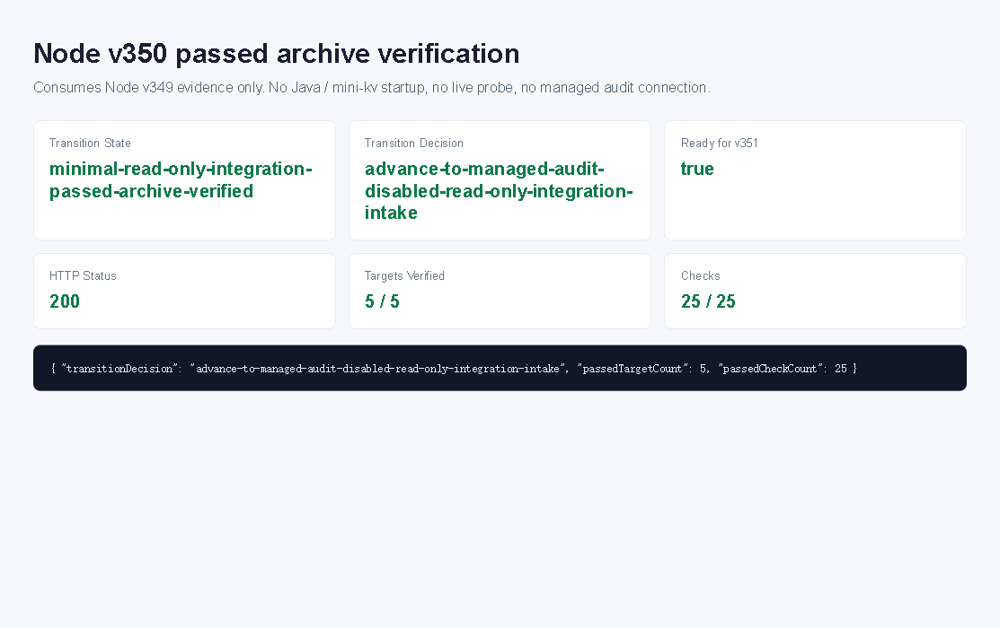

# Node v350：minimal read-only integration passed archive verification

## 版本进度

v350 消费 v349 的真实只读联调归档，不再启动 Java / mini-kv，也不再 live probe。它只验证 v349 已归档证据是否完整、是否为 `all-read-passed`，并生成下一阶段切换决策。

本轮结论：

```text
transitionState: minimal-read-only-integration-passed-archive-verified
transitionDecision: advance-to-managed-audit-disabled-read-only-integration-intake
readyForNodeV351ManagedAuditDisabledReadOnlyIntegrationIntake: true
attemptedTargetCount: 5
passedTargetCount: 5
checkCount: 25
passedCheckCount: 25
```

## 本版新增

- 新增 v350 passed archive verification 类型、服务、Markdown renderer。
- 新增 audit JSON/Markdown route。
- 新增 focused tests，覆盖 v349 归档验证、缺归档 fail-closed、route 输出。
- 归档 HTTP JSON、Markdown、summary、HTML、浏览器截图和 snapshot。

## 关键边界

- 不启动 Java。
- 不启动 mini-kv。
- 不重新 live probe。
- 不读取 managed audit credential value。
- 不解析 raw endpoint URL。
- 不连接 managed audit endpoint。
- 不实现或调用 runtime shell。
- 不执行 Java ledger/schema/SQL/deployment/rollback。
- 不执行 mini-kv write/admin 命令。

## 验证结果

- `npm.cmd run typecheck`：通过
- focused vitest：v350 1 file / 3 tests 通过
- 小组 vitest：v349 + v350 2 files / 6 tests 通过
- `npm.cmd run build`：通过
- HTTP smoke：200 JSON / 200 Markdown，`transitionDecision=advance-to-managed-audit-disabled-read-only-integration-intake`
- 浏览器截图：Playwright MCP data-page summary 截图已保存；route 真值以 HTTP evidence 为准

## 证据文件

- `d/350/evidence/minimal-read-only-integration-passed-archive-verification-v350-http.json`
- `d/350/evidence/minimal-read-only-integration-passed-archive-verification-v350-http.md`
- `d/350/evidence/minimal-read-only-integration-passed-archive-verification-v350-summary.json`
- `d/350/evidence/minimal-read-only-integration-passed-archive-verification-v350-browser-snapshot.md`
- `d/350/minimal-read-only-integration-passed-archive-verification-v350.html`

## 截图



## 结论

v350 把 v349 的真实只读联调通过结果固化成阶段切换证据。下一步可以进入 managed-audit-disabled read-only integration intake，但仍不能读取密钥、解析真实 endpoint、实例化 provider/client、打开 runtime shell 或执行任何上游写操作。
