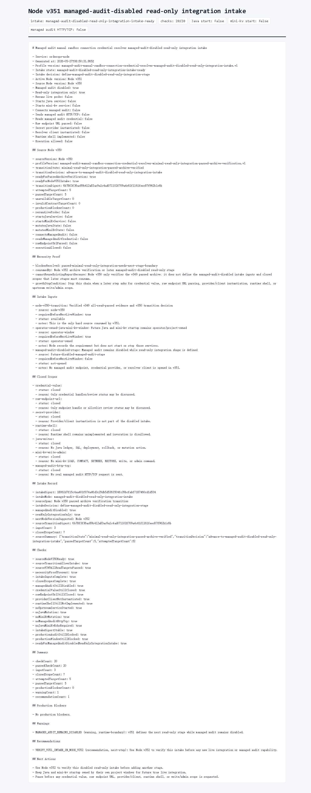

# Node v351：managed-audit-disabled read-only integration intake

## 版本进度

v351 消费 v350 的阶段切换决策，定义下一阶段 `managed-audit-disabled read-only integration` 的 intake 输入和关闭边界。它不重新 live probe，不启动 Java / mini-kv，也不连接 managed audit。

本轮结论：

```text
intakeState: managed-audit-disabled-read-only-integration-intake-ready
intakeDecision: define-managed-audit-disabled-read-only-integration-stage
readyForManagedAuditDisabledReadOnlyIntegrationIntake: true
checkCount: 20
passedCheckCount: 20
inputCount: 3
closedScopeCount: 7
```

## 本版新增

- 新增 v351 intake 类型、服务、Markdown renderer。
- 新增 audit JSON/Markdown route。
- 新增 focused tests，覆盖 v350 transition 消费、缺源证据 fail-closed、route 输出。
- 归档 HTTP JSON、Markdown、summary、HTML、Playwright MCP 截图和 browser snapshot。

## 关键边界

- 不启动 Java。
- 不启动 mini-kv。
- 不重新 live probe。
- 不读取 managed audit credential value。
- 不解析 raw endpoint URL。
- 不实例化 secret provider 或 resolver client。
- 不实现或调用 runtime shell。
- 不发送 managed audit HTTP/TCP。
- 不执行 Java ledger/schema/SQL/deployment/rollback。
- 不执行 mini-kv LOAD/COMPACT/SETNXEX/RESTORE/write/admin。

## 验证结果

- `npm.cmd run typecheck`：通过
- focused vitest：v351 1 file / 3 tests 通过
- 小组 vitest：v350 + v351 2 files / 6 tests 通过
- `npm.cmd run build`：通过
- HTTP smoke：200 JSON / 200 Markdown，`intakeDecision=define-managed-audit-disabled-read-only-integration-stage`
- 浏览器截图：Playwright MCP 通过静态归档页完成截图

## 证据文件

- `d/351/evidence/managed-audit-disabled-read-only-integration-intake-v351-http.json`
- `d/351/evidence/managed-audit-disabled-read-only-integration-intake-v351-http.md`
- `d/351/evidence/managed-audit-disabled-read-only-integration-intake-v351-summary.json`
- `d/351/evidence/managed-audit-disabled-read-only-integration-intake-v351-browser-snapshot.md`
- `d/351/managed-audit-disabled-read-only-integration-intake-v351.html`

## 截图



## 结论

v351 把 v350 的 `advance-to-managed-audit-disabled-read-only-integration-intake` 决策变成了下一阶段 intake 合同。下一步可以由 Node v352 验证这份 intake archive，但仍不能打开 credential value、raw endpoint、provider/client、runtime shell 或写操作能力。
