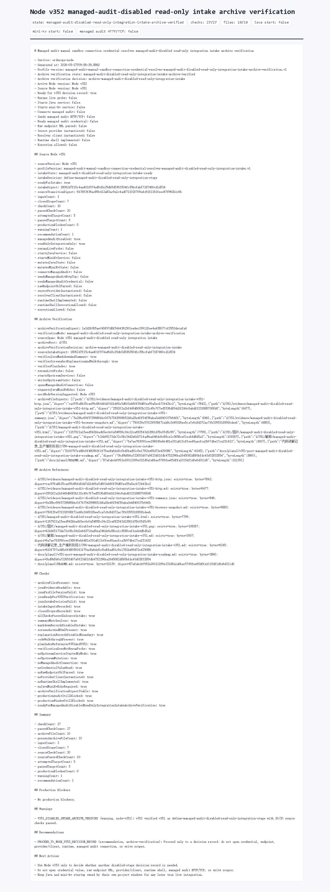

# Node v352：managed-audit-disabled read-only integration intake archive verification

## 版本进度

v352 消费 v351 的归档文件，不重新 live probe，不启动 Java / mini-kv，也不连接 managed audit。它只验证 v351 intake 的 JSON、Markdown、summary、截图、解释、代码讲解和计划索引是否完整一致。

本轮结论：

```text
archiveVerificationState: managed-audit-disabled-read-only-integration-intake-archive-verified
archiveVerificationDecision: archive-managed-audit-disabled-read-only-integration-intake
readyForNodeV353ManagedAuditDisabledReadOnlyIntegrationDecisionRecord: true
archiveFileCount: 10
presentArchiveFileCount: 10
checkCount: 27
passedCheckCount: 27
```

## 本版新增

- 新增 v352 intake archive verification 类型、服务、Markdown renderer。
- 新增 audit JSON/Markdown route。
- 新增 focused tests，覆盖 v351 归档验证、缺归档 fail-closed、route 输出。
- 归档 HTTP JSON、Markdown、summary、HTML、Playwright MCP 截图和 browser snapshot。

## 关键边界

- 不启动 Java。
- 不启动 mini-kv。
- 不重新 live probe。
- 不读取 managed audit credential value。
- 不解析 raw endpoint URL。
- 不实例化 secret provider 或 resolver client。
- 不实现或调用 runtime shell。
- 不发送 managed audit HTTP/TCP。
- 不执行 Java ledger/schema/SQL/deployment/rollback。
- 不执行 mini-kv LOAD/COMPACT/SETNXEX/RESTORE/write/admin。

## 验证结果

- `npm.cmd run typecheck`：通过
- focused vitest：v352 1 file / 3 tests 通过
- 小组 vitest：v351 + v352 2 files / 6 tests 通过
- `npm.cmd run build`：通过
- HTTP smoke：200 JSON / 200 Markdown，`archiveVerificationDecision=archive-managed-audit-disabled-read-only-integration-intake`
- 浏览器截图：Playwright MCP 通过静态归档页完成截图

## 证据文件

- `d/352/evidence/managed-audit-disabled-read-only-integration-intake-archive-verification-v352-http.json`
- `d/352/evidence/managed-audit-disabled-read-only-integration-intake-archive-verification-v352-http.md`
- `d/352/evidence/managed-audit-disabled-read-only-integration-intake-archive-verification-v352-summary.json`
- `d/352/evidence/managed-audit-disabled-read-only-integration-intake-archive-verification-v352-browser-snapshot.md`
- `d/352/managed-audit-disabled-read-only-integration-intake-archive-verification-v352.html`

## 截图



## 结论

v352 把 v351 intake 固化成可审计归档证据。下一步可以做 Node v353 decision record，但仍不能打开 credential value、raw endpoint、provider/client、runtime shell、managed audit HTTP/TCP 或任何上游写操作。
