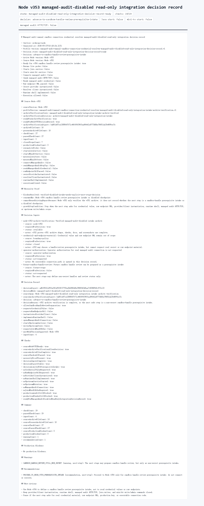

# Node v353：managed-audit-disabled read-only integration decision record

## 版本进度

v353 消费 v352 的 archive verification，不重新读取 v351 归档、不重新 live probe、不启动 Java / mini-kv，也不连接 managed audit。它只记录下一步决策：可以进入非 secret 的 sandbox handle review prerequisite intake，但不能打开 credential、raw endpoint、provider/client、runtime shell 或真实 HTTP/TCP。

本轮结论：

```text
decisionState: managed-audit-disabled-read-only-integration-decision-record-ready
decision: advance-to-sandbox-handle-review-prerequisite-intake
readyForNodeV354SandboxHandleReviewPrerequisiteIntake: true
checkCount: 19
passedCheckCount: 19
```

## 本版新增

- 新增 v353 decision record 类型、服务、Markdown renderer。
- 新增 audit JSON/Markdown route。
- 新增 focused tests，覆盖 v352 消费、缺源证据 fail-closed、route 输出。
- 归档 HTTP JSON、Markdown、summary、HTML、Playwright MCP 截图和 browser snapshot。

## 关键边界

- 不启动 Java。
- 不启动 mini-kv。
- 不重新 live probe。
- 不读取 managed audit credential value。
- 不解析 raw endpoint URL。
- 不实例化 secret provider 或 resolver client。
- 不实现或调用 runtime shell。
- 不发送 managed audit HTTP/TCP。
- 不执行 Java ledger/schema/SQL/deployment/rollback。
- 不执行 mini-kv LOAD/COMPACT/SETNXEX/RESTORE/write/admin。

## 验证结果

- `npm.cmd run typecheck`：通过
- focused vitest：v353 1 file / 3 tests 通过
- 小组 vitest：v352 + v353 2 files / 6 tests 通过
- `npm.cmd run build`：通过
- HTTP smoke：200 JSON / 200 Markdown，`decision=advance-to-sandbox-handle-review-prerequisite-intake`
- 浏览器截图：Playwright MCP 通过静态归档页完成截图

## 证据文件

- `d/353/evidence/managed-audit-disabled-read-only-integration-decision-record-v353-http.json`
- `d/353/evidence/managed-audit-disabled-read-only-integration-decision-record-v353-http.md`
- `d/353/evidence/managed-audit-disabled-read-only-integration-decision-record-v353-summary.json`
- `d/353/evidence/managed-audit-disabled-read-only-integration-decision-record-v353-browser-snapshot.md`
- `d/353/managed-audit-disabled-read-only-integration-decision-record-v353.html`

## 截图



## 结论

v353 把 v352 的归档验证结果转成下一阶段决策。下一步可以做 Node v354 的 sandbox handle review prerequisite intake，但它只能定义非 secret handle/review status 输入，不能读取密钥、解析 raw endpoint、实例化 provider/client、实现 runtime shell 或打开 managed audit 连接。
