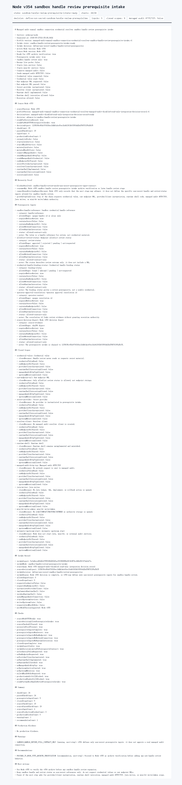

# Node v354：sandbox handle review prerequisite intake

## 版本进度

v354 消费 v353 的 decision record，把下一步收束成一个非敏感的 sandbox handle review 前置输入合同。它只定义可以进入 review 的输入形状，不读取 credential value、不解析 raw endpoint URL、不实例化 provider/client、不实现 runtime shell，也不向 managed audit 发 HTTP/TCP。

本轮结论：

```text
intakeState: sandbox-handle-review-prerequisite-intake-ready
intakeDecision: define-non-secret-sandbox-handle-review-prerequisites
readyForNodeV355SandboxHandleReviewPrerequisiteIntakeArchiveVerification: true
checkCount: 24
passedCheckCount: 24
prerequisiteInputCount: 5
closedScopeCount: 9
```

## 本版新增

- 新增 v354 prerequisite intake 类型、服务、Markdown renderer。
- 新增 audit JSON/Markdown route。
- 新增 focused tests，覆盖 v353 消费、缺源证据 fail-closed、route 输出。
- 归档 HTTP JSON、Markdown、summary、HTML、Playwright MCP 截图和 browser snapshot。

## 关键边界

- 不启动 Java。
- 不启动 mini-kv。
- 不重新 live probe。
- 不读取或请求 managed audit credential value。
- 不解析或输出 raw endpoint URL。
- 不实例化 secret provider 或 resolver client。
- 不实现或调用 runtime shell。
- 不发送 managed audit HTTP/TCP。
- 不执行 Java ledger/schema/SQL/deployment/rollback。
- 不执行 mini-kv LOAD/COMPACT/SETNXEX/RESTORE/write/admin。

## 验证结果

- `npm.cmd run typecheck`：通过
- focused vitest：v354 1 file / 3 tests 通过
- 小组 vitest：v353 + v354 2 files / 6 tests 通过
- `npm.cmd run build`：通过
- HTTP smoke：200 JSON / 200 Markdown，`intakeDecision=define-non-secret-sandbox-handle-review-prerequisites`
- 浏览器截图：Playwright MCP 通过静态归档页完成截图

## 证据文件

- `d/354/evidence/sandbox-handle-review-prerequisite-intake-v354-http.json`
- `d/354/evidence/sandbox-handle-review-prerequisite-intake-v354-http.md`
- `d/354/evidence/sandbox-handle-review-prerequisite-intake-v354-summary.json`
- `d/354/evidence/sandbox-handle-review-prerequisite-intake-v354-browser-snapshot.md`
- `d/354/sandbox-handle-review-prerequisite-intake-v354.html`

## 截图



## 结论

v354 没有打开真实连接，而是把下一阶段的输入边界讲清楚：只允许 opaque handle、review status、binding status、operator correlation 和 v353 digest 这类非 secret 输入。下一步 v355 适合先做 archive verification，再决定是否继续推进 handle review。
