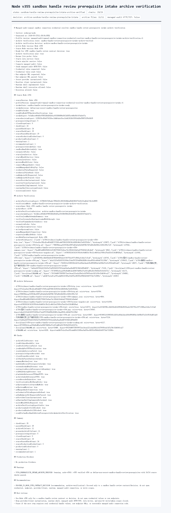

# Node v355：sandbox handle review prerequisite intake archive verification

## 版本进度

v355 消费 v354 的归档材料，验证 sandbox handle review prerequisite intake 是否完整可追溯。它只做归档验证，不新增 handle review 行为，不请求 Java / mini-kv，也不打开 credential、raw endpoint、provider/client、runtime shell 或 managed audit HTTP/TCP。

本轮结论：

```text
archiveVerificationState: sandbox-handle-review-prerequisite-intake-archive-verified
archiveVerificationDecision: archive-sandbox-handle-review-prerequisite-intake
readyForNodeV356SandboxHandleReviewContractDecision: true
checkCount: 29
passedCheckCount: 29
archiveFileCount: 11
presentArchiveFileCount: 11
```

## 本版新增

- 新增 v355 archive verification 类型、服务、Markdown renderer。
- 新增 audit JSON/Markdown route。
- 新增 focused tests，覆盖 v354 归档验证、缺归档 fail-closed、route 输出。
- 归档 HTTP JSON、Markdown、summary、HTML、Playwright MCP 截图和 browser snapshot。

## 关键边界

- 不启动 Java。
- 不启动 mini-kv。
- 不重新 live probe。
- 不读取或请求 managed audit credential value。
- 不解析或输出 raw endpoint URL。
- 不实例化 secret provider 或 resolver client。
- 不实现或调用 runtime shell。
- 不发送 managed audit HTTP/TCP。
- 不执行 Java ledger/schema/SQL/deployment/rollback。
- 不执行 mini-kv LOAD/COMPACT/SETNXEX/RESTORE/write/admin。

## 验证结果

- `npm.cmd run typecheck`：通过
- focused vitest：v355 1 file / 3 tests 通过
- 小组 vitest：v354 + v355 2 files / 6 tests 通过
- `npm.cmd run build`：通过
- HTTP smoke：200 JSON / 200 Markdown，`archiveVerificationDecision=archive-sandbox-handle-review-prerequisite-intake`
- 浏览器截图：Playwright MCP 通过静态归档页完成截图

## 证据文件

- `d/355/evidence/sandbox-handle-review-prerequisite-intake-archive-verification-v355-http.json`
- `d/355/evidence/sandbox-handle-review-prerequisite-intake-archive-verification-v355-http.md`
- `d/355/evidence/sandbox-handle-review-prerequisite-intake-archive-verification-v355-summary.json`
- `d/355/evidence/sandbox-handle-review-prerequisite-intake-archive-verification-v355-browser-snapshot.md`
- `d/355/sandbox-handle-review-prerequisite-intake-archive-verification-v355.html`

## 截图



## 结论

v355 证明 v354 的非 secret prerequisite intake 归档完整：JSON、Markdown、summary、HTML、截图、解释、代码讲解、计划索引和 `d/README.md` 都对齐。下一步可以进入 Node v356 的 sandbox handle review contract/decision，但仍不能打开真实 credential、endpoint、provider/client、runtime shell 或 managed audit 连接。
