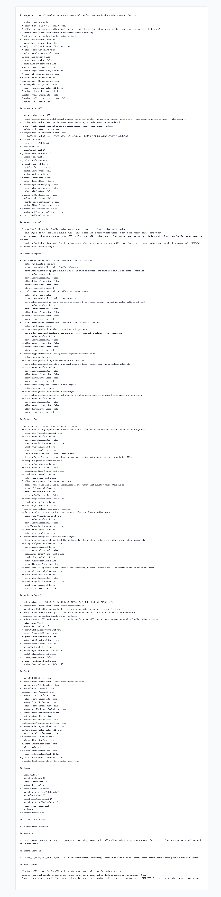

# Node v356：sandbox handle review contract decision

## 版本进度

v356 消费 v355 的 archive verification，推进到 sandbox handle review 的合同/决策层。它只定义后续 review contract 需要哪些非 secret 输入和章节，不读取 credential value，不解析 raw endpoint URL，也不实例化 provider/client 或 runtime shell。

本轮结论：

```text
decisionState: sandbox-handle-review-contract-decision-ready
decision: define-sandbox-handle-review-contract
readyForNodeV357SandboxHandleReviewContractDecisionArchiveVerification: true
checkCount: 25
passedCheckCount: 25
contractInputCount: 5
contractSectionCount: 6
sourceArchiveFileCount: 11
sourcePresentArchiveFileCount: 11
sourceCheckCount: 29
sourcePassedCheckCount: 29
```

## 本版新增

- 新增 v356 contract decision 类型、服务、Markdown renderer。
- 新增 audit JSON/Markdown route。
- 新增 focused tests，覆盖 v355 消费、空归档 fail-closed、route 输出。
- 归档 HTTP JSON、Markdown、summary、HTML、Playwright MCP 截图和 browser snapshot。

## 关键边界

- 不启动 Java。
- 不启动 mini-kv。
- 不重新 live probe。
- 不读取或请求 managed audit credential value。
- 不解析或输出 raw endpoint URL。
- 不实例化 secret provider 或 resolver client。
- 不实现或调用 runtime shell。
- 不发送 managed audit HTTP/TCP。
- 不执行 Java ledger/schema/SQL/deployment/rollback。
- 不执行 mini-kv LOAD/COMPACT/SETNXEX/RESTORE/write/admin。

## 验证结果

- `npm.cmd run typecheck`：通过
- focused vitest：v356 1 file / 3 tests 通过
- 小组 vitest：v355 + v356 2 files / 6 tests 通过
- `npm.cmd run build`：通过
- HTTP smoke：200 JSON / 200 Markdown，`decision=define-sandbox-handle-review-contract`
- 浏览器截图：Playwright MCP 通过静态归档页完成截图

## 证据文件

- `d/356/evidence/sandbox-handle-review-contract-decision-v356-http.json`
- `d/356/evidence/sandbox-handle-review-contract-decision-v356-http.md`
- `d/356/evidence/sandbox-handle-review-contract-decision-v356-summary.json`
- `d/356/evidence/sandbox-handle-review-contract-decision-v356-browser-snapshot.md`
- `d/356/sandbox-handle-review-contract-decision-v356.html`

## 截图



## 结论

v356 把 v355 归档验证结果转换成后续 sandbox handle review 的合同决策：5 个非 secret contract inputs 和 6 个 contract sections 都保持 closed boundary。下一步可以进入 Node v357 的 archive verification，但仍不能打开真实 credential、raw endpoint、provider/client、runtime shell 或 managed audit 连接。
