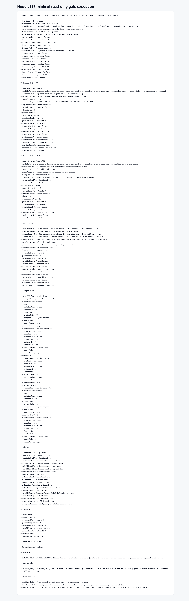

# Node v367 运行解释：minimal read-only integration gate execution

## 版本来源

v367 由 Node v366 衍生。v366 的结论是 `wait-for-external-read-window`，并且计划已经补充 Java / mini-kv 的读窗口启动要求。

本轮用户已确认两边已经启动，所以 v367 执行真实最小只读 gate：

```text
Java:
- GET /actuator/health
- GET /api/v1/ops/overview

mini-kv:
- HEALTH
- INFOJSON
- STATSJSON
```

## 本轮结果

```text
gateExecutionState: minimal-read-only-integration-gate-executed
gateExecutionResult: all-read-passed
gateExecutionDecision: archive-read-passed-gate-execution
attemptedTargetCount: 5
passedTargetCount: 5
checkCount: 20
passedCheckCount: 20
productionBlockerCount: 0
```

## 边界保持

v367 没有启动 Java / mini-kv，只消费用户已经打开的读窗口：

```text
startsJavaService: false
startsMiniKvService: false
mutatesJavaState: false
mutatesMiniKvState: false
connectsManagedAudit: false
sendsManagedAuditHttpTcp: false
credentialValueRead: false
rawEndpointUrlParsed: false
runtimeShellImplemented: false
executionAllowed: false
```

## 实现方式

v367 没有新造一套探测系统，而是复用 v349 已经稳定的 smoke lane：

```text
reusesNodeV349MinimalReadOnlySmokeLane: true
```

这样能避免真实联调链路继续膨胀。v367 只负责把 v366 的显式读窗口决策和 v349 的实际只读 probe 组合成一次 regular gate execution evidence。

## 验证

本轮按分批验证执行：

```text
npm run typecheck
npx vitest run test/managedAuditManualSandboxConnectionCredentialResolverMinimalReadOnlyIntegrationGateExecution.test.ts
npx vitest run test/managedAuditManualSandboxConnectionCredentialResolverMinimalReadOnlyIntegrationRegularGateArchiveVerification.test.ts test/managedAuditManualSandboxConnectionCredentialResolverMinimalReadOnlyIntegrationExplicitReadWindowGateExecutionDecision.test.ts test/managedAuditManualSandboxConnectionCredentialResolverMinimalReadOnlyIntegrationGateExecution.test.ts
npm run build
HTTP smoke: 200, 5/5 read targets passed, 20/20 checks passed
Playwright MCP screenshot/snapshot: completed against generated HTML evidence
```

## 归档文件

- HTTP JSON：`d/367/evidence/minimal-read-only-integration-gate-execution-v367-http.json`
- HTTP Markdown：`d/367/evidence/minimal-read-only-integration-gate-execution-v367-http.md`
- Summary：`d/367/evidence/minimal-read-only-integration-gate-execution-v367-summary.json`
- Browser snapshot：`d/367/evidence/minimal-read-only-integration-gate-execution-v367-browser-snapshot.md`
- HTML：`d/367/minimal-read-only-integration-gate-execution-v367.html`
- 截图：`d/367/图片/minimal-read-only-integration-gate-execution-v367.png`



## 下一步

v367 已真实通过最小只读 gate。下一步适合做 Node v368：验证 v367 归档完整性，并决定是否把这个 gate 固化为后续 operator / CI 的常规只读门禁。
