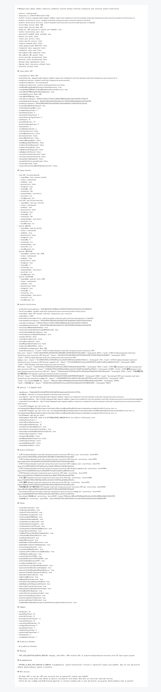

# Node v368 运行解释：minimal read-only gate execution archive verification

## 版本来源

v368 由 Node v367 衍生。v367 已经在用户打开 Java / mini-kv 读窗口后完成真实最小只读 gate execution：

```text
attemptedTargetCount: 5
passedTargetCount: 5
checkCount: 20
passedCheckCount: 20
gateExecutionDecision: archive-read-passed-gate-execution
```

v368 不重新探测 Java / mini-kv，只验证 `d/367` 归档能否作为后续 operator / CI 常规门禁证据使用。

## 本轮结果

```text
archiveVerificationState: minimal-read-only-integration-gate-execution-archive-verified
archiveVerificationDecision: archive-minimal-read-only-gate-execution-and-operator-ci-handoff
archiveFileCount: 11
presentArchiveFileCount: 11
sourceCheckCount: 20
sourcePassedCheckCount: 20
attemptedTargetCount: 5
passedTargetCount: 5
productionBlockerCount: 0
```

## 边界保持

v368 是 archive verification，不执行真实上游读取：

```text
rerunsLiveProbe: false
startsJavaService: false
startsMiniKvService: false
mutatesJavaState: false
mutatesMiniKvState: false
connectsManagedAudit: false
sendsManagedAuditHttpTcp: false
credentialValueRead: false
rawEndpointUrlParsed: false
runtimeShellImplemented: false
executionAllowed: false
```

## 实现方式

v368 读取并校验这些 v367 归档文件：

```text
d/367/evidence/minimal-read-only-integration-gate-execution-v367-http.json
d/367/evidence/minimal-read-only-integration-gate-execution-v367-http.md
d/367/evidence/minimal-read-only-integration-gate-execution-v367-summary.json
d/367/evidence/minimal-read-only-integration-gate-execution-v367-browser-snapshot.md
d/367/minimal-read-only-integration-gate-execution-v367.html
d/367/图片/minimal-read-only-integration-gate-execution-v367.png
d/367/解释/minimal-read-only-integration-gate-execution-v367.md
代码讲解记录_生产雏形阶段2/372-minimal-read-only-integration-gate-execution-v367.md
docs/plans2/v367-post-minimal-read-only-integration-gate-execution-roadmap.md
docs/plans2/README.md
d/README.md
```

同时额外验证：

```text
targetResults: 5 个目标全部 read-passed
Java: 只允许 GET /actuator/health 与 GET /api/v1/ops/overview
mini-kv: 只允许 HEALTH / INFOJSON / STATSJSON
v367 reusesNodeV349MinimalReadOnlySmokeLane=true
v368 自身不 rerun probe
```

## 验证

本轮按分批验证执行，没有一次性跑大批量测试：

```text
npm run typecheck
npx vitest run test/managedAuditManualSandboxConnectionCredentialResolverMinimalReadOnlyIntegrationGateExecutionArchiveVerification.test.ts
npx vitest run test/managedAuditManualSandboxConnectionCredentialResolverMinimalReadOnlyIntegrationGateExecution.test.ts test/managedAuditManualSandboxConnectionCredentialResolverMinimalReadOnlyIntegrationGateExecutionArchiveVerification.test.ts
npm run build
HTTP smoke: 200，archive verification ready=true
Playwright MCP screenshot/snapshot: completed against generated HTML evidence
```

## 归档文件

- HTTP JSON：`e/368/evidence/minimal-read-only-gate-execution-archive-verification-v368-http.json`
- HTTP Markdown：`e/368/evidence/minimal-read-only-gate-execution-archive-verification-v368-http.md`
- Summary：`e/368/evidence/minimal-read-only-gate-execution-archive-verification-v368-summary.json`
- Browser snapshot：`e/368/evidence/minimal-read-only-gate-execution-archive-verification-v368-browser-snapshot.md`
- HTML：`e/368/minimal-read-only-gate-execution-archive-verification-v368.html`
- 截图：`e/368/图片/minimal-read-only-gate-execution-archive-verification-v368.png`



## 下一步

v368 已证明 v367 归档可以作为常规门禁证据。下一步 Node v369 应只做 operator / CI handoff 和契约冻结，不再继续扩展 Node 前置归档链。之后 mini-kv 可以并行推进 shard readiness 原型，Java 可以并行推进 shard readiness echo，Node 只作为契约消费者和联调门禁。
