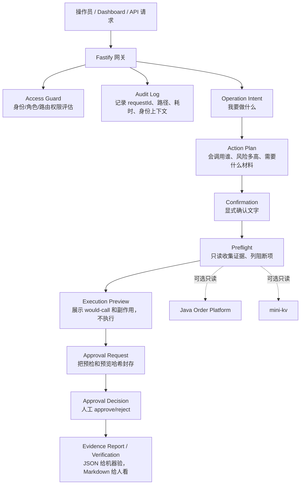

# OrderOps Node 通俗透明说明

可以把 `orderops-node` 理解成一句话：

它不是“订单系统本体”，而是夹在操作员、Java 订单平台、mini-kv 存储服务之间的一层 **生产前管控台**：先把危险操作拆成“意图、证据、预检、审批、哈希、归档”，默认不执行真实写操作，直到所有前置条件都说清楚、可复验。

核心价值不是“多一个接口代理”，而是：**让一次可能影响订单或存储的操作，在真正执行前变成可审查、可追责、可回放的证据链。**



## 它到底在做什么

`orderops-node` 的真实定位有四层：

1. 网关层：用 Fastify 暴露 `/health`、Dashboard、Java 代理、mini-kv 代理、状态报告、审计报告。
2. 操作安全层：把“我要重放失败事件”“我要写 mini-kv key”“我要创建订单”先变成 `operation intent`，判断角色、风险、开关、确认文字。
3. 证据治理层：生成 preflight、execution preview、approval request、approval decision、evidence report，并用 SHA-256 digest 把关键字段封住。
4. 生产准备层：大量 `/readiness`、`/verification`、`?format=markdown` 路由，用来回答“现在离真实生产操作还差什么”。

它的边界也很重要：Java 项目负责订单一致性、失败事件、业务交易；mini-kv 负责存储和网络命令；Node 负责“能不能碰、怎么证明、谁批准、出了事怎么追”。

## 一步一步的输入输出

| 步骤 | 输入 | 处理 | 输出 |
|---|---|---|---|
| 启动配置 | 环境变量，如 `ORDER_PLATFORM_URL`、`MINIKV_PORT`、`UPSTREAM_PROBES_ENABLED`、`UPSTREAM_ACTIONS_ENABLED` | `loadConfig` 读取并设置安全默认值 | `AppConfig`，默认 probes/actions 都关闭 |
| 请求进入 | HTTP method/path/headers/body | Fastify 分配 requestId，写安全响应头 | 带 `x-orderops-request-id` 的响应 |
| 权限评估 | 路由、角色 header、auth mode | Access Guard 判断 route group、required role、wouldDeny | 审计上下文 + 响应头；开启 enforcement 时可 401/403 |
| 创建操作意图 | `action`、`target`、`operatorId`、`role`、`reason` | 查 action catalog，判断风险和开关 | intent：状态、计划、要求确认文字 |
| 显式确认 | `intentId`、`operatorId`、`confirmText` | 校验操作者一致、确认文字一致、未过期 | confirmed intent 或拒绝原因 |
| 预检 | `intentId`，可带 `failedEventId`、`keyPrefix` | 只读收集 Java/mini-kv 证据；如果 probes 关闭就记录 skipped | preflight bundle：证据、blockers、warnings、next actions |
| 执行预览 | preflight + command/key/value 等上下文 | 生成 would-call、预期副作用、阻断项 | execution preview，不触碰真实上游 |
| 审批请求 | execution preview、reviewer | 对 preflight 和 preview 做 digest | approval request：pending/rejected、digest、blockers |
| 审批决定 | `requestId`、approve/reject、reviewer、reason | 只记录决定，不执行上游 | approval decision ledger |
| 证据报告 | request + decision | 生成报告和 verification | JSON 给测试/CI，Markdown 给人工归档 |

## 通俗例子：我要重放 Java 的失败事件

假设有一个失败事件 `failedEventId=123`，你不是直接点“重放”。

第一步，你提交意图：

```json
{
  "action": "failed-event-replay-readiness",
  "target": "order-platform",
  "operatorId": "alice",
  "role": "operator",
  "reason": "检查失败事件 123 是否具备重放条件"
}
```

输出不是“已重放”，而是：

```json
{
  "status": "pending-confirmation",
  "plan": {
    "action": "failed-event-replay-readiness",
    "risk": "read",
    "wouldCall": {
      "type": "http",
      "path": "/api/v1/failed-events/:failedEventId/replay-readiness"
    }
  },
  "confirmation": {
    "requiredText": "CONFIRM failed-event-replay-readiness"
  }
}
```

第二步，你确认：

```json
{
  "operatorId": "alice",
  "confirmText": "CONFIRM failed-event-replay-readiness"
}
```

输出：intent 变成 `confirmed`。

第三步，请求预检：

```text
GET /api/v1/operation-intents/{intentId}/preflight/report?failedEventId=123
```

如果 `UPSTREAM_PROBES_ENABLED=false`，它不会偷偷访问 Java，而是输出：

```json
{
  "safety": {
    "upstreamProbesEnabled": false,
    "upstreamActionsEnabled": false
  },
  "evidence": {
    "javaReplayReadiness": {
      "status": "skipped",
      "message": "UPSTREAM_PROBES_ENABLED=false; Java replay readiness was not requested."
    }
  },
  "hardBlockers": ["UPSTREAM_PROBES_ENABLED=false"],
  "readyForDryRunDispatch": false
}
```

这就是它的价值：系统没有假装“成功”，而是明确告诉你“我没查 Java，因为安全开关关着”。这比一个绿色但不真实的报告可靠得多。

如果 probes 开启，它才会只读访问 Java，拿到 replay readiness，然后仍然不会执行真实重放。下一步只会生成 execution preview，告诉你“如果执行，会调用哪个 URL，预期副作用是什么，有哪些阻断项”。

## 为什么有价值

最有价值的地方有五个：

1. **默认安全**：`UPSTREAM_ACTIONS_ENABLED=false` 时，写操作不会碰 Java/mini-kv。
2. **把风险显性化**：每个 action 都有 risk：diagnostic/read/write，并绑定 required role。
3. **证据可复验**：preflight、preview、approval 都有 digest，防止“审批的是 A，执行时变成 B”。
4. **人机双读**：同一份 profile 可以输出 JSON 和 Markdown；JSON 给测试/CI，Markdown 给人审。
5. **跨项目解耦**：Node 可以消费 Java/mini-kv 的 fixture 或只读证据，但不要求它们同时在线，也不冒充它们的业务逻辑。

## 目前工程成熟度

它已经超过练习项目，像“生产前治理工程”：权限、审计、证据、归档、CI gate 都很多。真正离生产级别还差的，不是再加更多文档链，而是把“只读真实运行窗口、分片 preview、真实审批材料、受控执行边界”逐步打通。

换个比喻：Java 是厨房，mini-kv 是仓库，Node 不是厨师也不是仓库管理员。Node 是操作控制室：谁要开哪扇门、为什么开、有没有审批、开门前看了哪些监控、最后有没有留下录像和签名。
