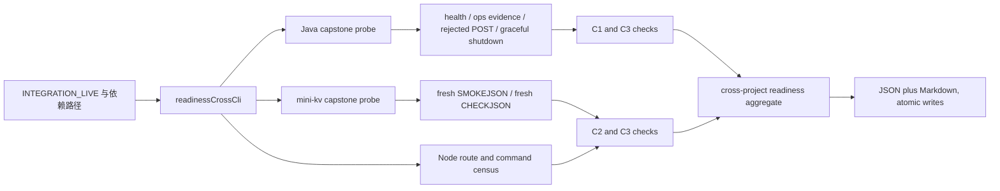

# v2191 代码讲解：把三项目“各自可验证”推进到一次真实、只读、可复现的联合验收

## 一、目标与非目标（Goal / Non-goal）

在 v2190 之前，Node、Java 与 mini-kv 已经分别具备相当完整的测试、归档、边界声明和证据契约。Node 也长期保存着 Java、mini-kv 的历史 fixture，并能验证这些文件的 schema、摘要和只读字段。但是，“能读取一份过去生成的正确文件”与“今天在这台机器上启动真实程序，再拿到一份刚刚产生的正确响应”不是同一层证据。前者证明契约曾经成立，后者才证明当前二进制、当前网络栈、当前进程生命周期和当前解析代码能够一起工作。

v2191 没有继续增加一条归档治理链，也没有把旧报告改名后冒充联合运行。它只完成最终验收计划中已经定义的最小真实切片：Node 在显式环境门下启动一个固定 Java commit 打出的 Spring Boot jar，读取两个只读 HTTP 端点；Node 直接执行真实 `minikv_cli`，从本次进程 stdout 中提取 `SMOKEJSON` 和 `CHECKJSON`；随后把静态权限表面、Java 拒写结果、mini-kv 无写结果聚合为一份 JSON 和一份 Markdown。运行结束后，Node 必须证明自己启动的 Java context 已优雅关闭、JVM PID 已消失、随机端口已释放。

这一步的价值不在于“又多一个 PASS”，而在于证据来源发生了变化：输入不再是冻结文件，而是确定 commit 的 jar、确定 SHA-256 的 CLI 二进制和本次新进程的输出；输出不再是一句人工结论，而是逐检查项的 `pass/fail/skipped`、进程标识、时间、摘要、schema 字段与清理事实。任何一个环节缺失，聚合结果都不能成为 `pass`。

## 二、整体数据流

入口是 `src/integration/readinessCrossCli.ts`。它只负责把环境变量转换成强类型配置、调用聚合器、写报告和设置退出码，不在入口文件里堆 HTTP、进程或 JSON 解析细节。`src/integration/crossProjectReadiness.ts` 负责状态组合；Java 与 mini-kv 各自有独立探针；报告渲染又是单独模块。这样拆分后，启动协议、业务边界、状态语义与展示格式不会纠缠在一个巨型文件中，任何一层变化都能用 focused test 单独定位。

## 三、C1：Java 实时读取与完整进程生命周期

### 1. 输入如何形成

真实运行要求 `INTEGRATION_LIVE=1` 和 `JAVA_CAPSTONE_JAR`。本次 jar 不是从 Java 正在修改的 v1848 工作树打包，而是从远端对齐的固定提交 `894deeb01837647af6dc125159ba5bc354f2cbb5` 创建 detached worktree 后构建。这样并行 Java 会话可以继续拆分文件，Node 得到的 jar 又不会混入未提交内容。jar 的 SHA-256 被写入报告，后续评审可以验证同一字节产物，而不是只相信文件名。

`buildJavaJarLaunchCommand` 显式加入 `prod` profile、loopback 地址、随机空闲端口和独立 H2 内存库。订单过期调度器与 outbox 发布器被关闭，H2 console 也被关闭。Flyway 对临时内存库执行启动迁移是 Spring context 的本地引导行为，数据随进程销毁；它不是对真实订单库的写入，也不授予 Node 业务执行权限。端口不写死为 8080，避免影响用户已有服务，并减少并行会话冲突。

### 2. 为什么 client 只有两个方法

`CrossProjectReadClient` 公开 `health()` 与 `opsEvidence()`，对应固定的两个 GET：`/actuator/health` 和 `/api/v1/ops/evidence`。它没有接收任意 method/path 的公共函数，也没有 create/pay/cancel 一类写方法。底层 GET helper 是模块私有函数，因此调用者不能借 capstone client 拼出另一个请求。`buildCapstoneRouteCensus` 同时枚举类原型的公开方法和 route catalog；只要新增方法没有登记、登记项不是 GET，C3 静态检查就失败。

这里没有删除项目原有的 `OrderPlatformClient` 写 API，因为那会改变既有产品契约。C3 约束的是本次被授权的联合验收表面：capstone runner 能拿到的 client 必须零写方法。旧 client 不被导入、不被注入，也不在命令执行路径上。这个隔离比在一个同时拥有 GET/POST 的大 client 上依赖“调用者自觉”更机械、更容易审计。

### 3. 启动、等待与 schema 校验

Java 子进程启动后，探针不是固定睡眠若干秒，而是在总启动预算内轮询 health。只有 HTTP 200 且 JSON `status` 等于 `UP` 才进入下一步；端口未监听、响应不是 JSON、进程提前退出或超时都形成明确失败原因。随后读取 ops evidence，并同时验证 `evidenceVersion`、`sampledAt`、`service.name`、active profile 包含 `prod`、`readOnly=true` 和 `executionAllowed=false`。这避免了“只要返回 200 就算兼容”的弱检查。

### 4. Java 拒写证明

C3 需要一次真实负向探针。runner 对 `/api/v1/failed-events/0/replay` 发送不带 `X-Operator-Id` 和 `X-Operator-Role` 的 POST，也不发送请求体。Java controller 的 request body 本来就是可选，因此这次 4xx 不是靠伪造坏 JSON 得到的；调用进入 controller 后，`FailedEventOperatorContextResolver` 会在业务 service 调用之前拒绝缺失身份头。探针只接受 400、401 或 403，任何 2xx 都会使 C3 失败。

这个 POST 是“证明写能力未被授予”的负向请求，不是执行尝试。它不包含有效身份、审批或业务数据，也没有可能通过 guard。报告仍明确记录 method、path、状态码以及 `identity_headers_sent=false`，让评审能够判断为什么该请求安全。

### 5. 为什么采用 Actuator shutdown

计划要求 Java 优雅退出。Windows 下 Node 向子进程发送 `SIGTERM` 往往会退化成强制终止，不能证明 Spring 的 graceful shutdown、JPA close 和 Hikari close 真正执行。因此本版只在随机 loopback 端口临时开放 Actuator shutdown，并在探针结束时调用它。它属于本次启动器的生命周期控制，不进入 `CrossProjectReadClient`，也不是业务上游权限。真实日志显示 Tomcat 开始并完成 graceful shutdown，EntityManagerFactory 与 HikariPool 随后关闭。

如果 shutdown HTTP 不是 200，或 context 在预算内没有退出，代码会按精确 child handle 做兜底清理，避免遗留进程；但只要使用了兜底 kill，C1 仍然是 fail，不能因为“最后清掉了”就伪装成优雅退出。这个区别很重要：清理责任与验收质量不能混为一个布尔值。

### 6. Windows 双 PID 的处理

第一次真实运行暴露了一个容易被忽略的证据问题：Node `spawn("java")` 得到的是 Windows 启动器 PID，而 Spring 日志中的实际 JVM PID 是另一个值。如果报告只写一个 `pid`，虽然功能已通过，外部评审仍无法知道检查的是启动器还是应用。最终实现从 Spring 的标准启动行提取 application PID，同时保留 launcher PID。退出后用 PID 0-signal 检查应用 PID 已不存在，再用 TCP 连接确认端口未开放。最终 C1 cleanup 必须同时满足 shutdown 200、未使用强杀、launcher 正常退出、application PID 不存活、端口关闭五个条件。

## 四、C2：真实 mini-kv CLI，而不是冻结 fixture

### 1. 命令计划先于进程启动

mini-kv 输入被固定为三行：`SMOKEJSON`、`CHECKJSON GET capstone:probe`、`QUIT`。`buildMiniKvCommandCensus` 在 spawn 前检查外层 verb 与 `CHECKJSON` 内层 verb；SET、SETNXEX、DEL、EXPIRE、SAVE、LOAD、COMPACT、RESETSTATS、RESTORE 等写入或管理命令一旦出现，进程根本不会启动。此处检查的不是文档声明，而是 runner 即将写入 stdin 的同一数组，因此不存在文档写“GET”、代码悄悄发“SET”的分叉。

真实 `minikv_cli.exe` 依赖 MinGW runtime，runner 允许通过 `MINIKV_RUNTIME_PATH` 只给子进程补 PATH。它不修改用户的全局环境，不启动 mini-kv server，也不访问 mini-kv 仓库中的 fixture。子进程 stdin 结束后必须在预算内正常退出；超时会被标为 `timed_out=true`，即使被终止后返回一个看似正常的码也不能通过。

### 2. “新鲜”是如何证明的

runner 记录进程 PID、开始和结束时间、CLI 可执行文件 SHA-256、stdout 字节数与 stdout SHA-256。本次 stdout 超过四十万字节，包含完整 SMOKEJSON 的大量历史兼容字段；把全文重复塞进 Markdown 会严重降低可读性，因此报告只保留经过验证的关键字段和全文摘要。评审若要复核原始输出，可用相同二进制、相同三行 stdin 重跑，摘要会对动态字段变化保持诚实，而不是把某个旧输出冒充本次结果。

解析器逐行寻找真实 JSON 起点，允许 CLI 的 `mini-kv>` 提示符存在，但必须同时找到 `evidence_type=runtime_smoke` 的对象和 `command=GET` 的 CHECKJSON 对象。少任何一个对象都会失败；代码没有读取备用 fixture 的路径，也没有“解析失败后回退历史证据”的分支。

### 3. 边界字段如何交叉校验

SMOKEJSON 要求 schema version 为 1、`read_only=true`、`execution_allowed=false`、`restore_execution_allowed=false`，并要求 `real_read` 中 write/admin/runtime-write 三个观测值全为 false。CHECKJSON 除了同样的只读和禁执行字段，还必须确认 command 是 GET、parser 允许、`write_command=false`、`wal_append_when_enabled=false`、`wal.touches_wal=false`。C3 的 mini-kv 结论复用这份刚产生的 CHECKJSON，而不是再加载另一份静态 receipt。

## 五、C3：三层无写证明为什么要同时存在

单靠“我们只打算读”不够。v2191 把无写证明分成三层：第一层是 Node 静态能力表面，route census 和 command census 必须都是零写；第二层是 Java 真实服务对未认证写 route 的拒绝；第三层是 mini-kv 对具体 GET 命令返回的 parser、side-effect 和 WAL 证明。三层分别覆盖“Node 能发什么”“Java 会接受什么”“mini-kv 实际如何解释命令”。

这种组合避免两个常见漏洞。其一，只有静态 allowlist 时，上游配置错误仍可能让写 route 无鉴权通过；其二，只有一次运行结果时，runner 自身未来可能新增写方法而测试恰好没走到。静态能力检查与真实负向检查互相补足，任何一层 fail 都使 C3 fail。

## 六、C4：状态代数、单命令和原子报告

`runCrossProjectReadiness` 不使用模糊的 truthy/falsy 聚合。每个 check 只有 `pass`、`fail`、`skipped` 三种状态；一个 requirement 中出现 fail，则 requirement 为 fail；没有 fail 但存在 skipped，则为 skipped；只有全部 pass 才是 pass。顶层同样按 C1、C2、C3 聚合。因此默认未开 live gate 时，静态 census 虽然 pass，Java 与 mini-kv 实时项仍是 skipped，最终一定是 skipped，绝不可能因为“没有抛异常”变成绿色。

当 `INTEGRATION_LIVE=1` 时，缺 jar 或 CLI 路径不再是 skip，而是配置 fail，并让命令以非零码结束。真实运行中任一 schema 漂移、写信号、超时或清理失败也会非零退出。只有未请求 live 的正常默认模式允许 overall skipped 且退出 0，这让默认 CI 可以验证机制而不依赖本机兄弟项目，同时仍能从报告看出它没有做真实验收。

报告写入采用同目录临时文件加 rename。JSON 或 Markdown 写到一半时进程中断，不会留下看似完整的最终文件；`finally` 会删除 partial 文件。JSON 保存全部机器可读证据，Markdown 只展示 requirement/check 表和 provenance，避免把数万行日志复制成不可阅读的文档。两份文件来自同一个内存 report，因此不会出现 JSON pass、Markdown fail 的状态分叉。

## 七、测试如何覆盖失败闭合

四个 focused 测试文件共九个测试。read client 测试检查原型公开方法恰好是 health 与 opsEvidence，并通过本地 HTTP server 验证两个 GET。Java probe 测试启动一个独立假进程，真实经历端口监听、health、evidence、拒写、shutdown、PID 消失和端口释放；它不是把 spawn mock 成固定返回值。mini-kv 测试执行独立假 CLI 进程，确认 stdin 命令顺序、stdout 解析和双 JSON 边界，同时用 `CHECKJSON SET` 证明 census 会识别嵌套写 verb。聚合测试覆盖 live gate 关闭、live 配置缺失失败和完整 live pass，并验证 JSON/Markdown 原子落盘。

这些测试验证的是编排机制，不替代最终真实运行。真实验收使用 Java jar 与真实 mini-kv CLI，再把报告归档到 `d/2191/evidence/`。默认 full suite 不会自动启动兄弟程序，这符合 final-acceptance 对 env-gated、默认 CI 排除的要求。

## 八、真实运行结果应该怎样阅读

最终 JSON 顶层必须看到 `live_requested=true`、`overall_status=pass`、`read_only=true`、`execution_allowed=false`。C1 包含 process、health、ops evidence、graceful shutdown；C2 包含 CLI process、SMOKEJSON、CHECKJSON；C3 包含 Node surface census、Java write rejection、mini-kv no execution。不能只看 overall，一项一项都应是 pass。

Java evidence 显示 `prod` profile、`java-ops-evidence.v1`、只读 true、执行 false。cleanup 显示 launcher/application 两个 PID、shutdown 200、未使用 fallback kill、application 不存活、端口不再开放。mini-kv evidence 显示实际二进制路径与 SHA-256、fresh stdout 摘要、SMOKEJSON 版本 `0.102.0`，以及 GET 不写、不碰 WAL。mini-kv 的当前仓库 commit 没有被冒充为旧 retained binary 的构建 commit，所以 provenance 中该字段保持未提供；可执行文件摘要才是本次被测对象的精确身份。

## 九、后续维护规则

如果 Java evidence schema 变化，应先判断是兼容增加还是必需字段改名；只有 final-acceptance 所需字段仍有明确等价物时才能修改 validator，并要新增失败样例。不能把 `readOnly` 或 `executionAllowed` 校验删掉来恢复绿色。新增 Java 读取端点时，必须同时登记 route catalog、公开 client 方法和 census 测试；任何非 GET 都不属于这个 client。

如果 mini-kv 命令变化，应先扩展 command census，再扩展 parser；不得增加写/admin verb，也不得添加 fixture fallback。CLI 输出很大时继续用全文 SHA 与关键字段摘要，不把全文堆进 Markdown。若需要证明新的动态字段，应在 JSON evidence 中新增小而明确的值，而不是复制整棵对象。

如果进程清理逻辑变化，必须保留“兜底清理可以避免泄漏，但不能算 graceful PASS”的原则。CI 仍默认关闭 `INTEGRATION_LIVE`；只有具备 jar、CLI 与运行时路径的受控本地窗口执行真实命令。v2191 完成后应停在外部 program-end review，不得因为本地全绿就自行进入 Stage 2，也不得把成熟度直接改成生产就绪。

## 十、本版没有做什么

本版没有改 Java 或 mini-kv 源码，没有启动 mini-kv server，没有调用 Java 有效写操作，没有启用 Node 的 `UPSTREAM_ACTIONS_ENABLED`，没有读取生产凭据，没有连接生产数据库，也没有修改成熟度标签。它证明的是一个最小、真实、只读的跨项目联合切片，以及这个切片能被一条命令完整生成、解释和清理。是否授予 capstone 最终 PASS，仍由外部评审根据归档证据决定。

## 十一、一句话总结（One-sentence summary）

v2191 用一条环境门控命令把固定 Java jar、真实 mini-kv CLI、三层无写证明和可核验进程清理合成同一份联合报告，同时把生产执行与 Stage 2 权限继续留在外部评审门外。
