# v2192 代码讲解：让第四个项目以真实产物进入联合验收，而不是把“生成报告”误算成 C4

## 一、Goal / 目标

v2192 解决的是一个非常具体、也很容易被漂亮措辞掩盖的证据缺口。v2191 已经能在显式环境门下启动固定 Java jar、执行真实 mini-kv CLI、证明 Node 的联合验证表面不含写能力，并用一条命令生成 JSON 和 Markdown。外部评审随后从更新后的 Java 提交独立重跑，确认 C1、C2、C3 都成立。但评审也发现：当时报告里根本没有 aiproj，所谓 C4 只是“把前三项写成一份报告”。单命令当然有价值，可它是承载机制，不是第四个项目的参与证据。若不修正，名称会领先于事实。

本版的目标是把 C4 改成真正的 `aiproj artifact validation`：Node 从 aiproj 已提交的 `docs/artifact-schema-guard-registry.json` 中选择一份登记产物，读取该 JSON，按注册表声明的必填字段、期望值和类型规则逐项验证，再把产物相对路径、字节数、SHA-256 与 aiproj commit 一起写入联合报告。由于选用的是 publication receipt，C4 还必须同时证明这份产物只允许下游治理查询，不能被解释成模型晋升授权。

这一变化使 `npm run readiness:cross` 的四个 requirement 分别对应四层真实事实：C1 是当前 Java 进程的只读响应，C2 是本次 mini-kv 进程的新鲜输出，C3 是跨 Node/Java/mini-kv 的无写证明，C4 是当前 aiproj 提交内真实、登记、可摘要的治理产物。单命令报告仍然存在，但它退回到正确的位置：负责汇总 C1-C4，而不是占用 C4 的编号。

## 二、Non-goal / 非目标

本版不启动 aiproj 的 Python、训练、评估、服务或任何脚本，不通过网络访问 aiproj，也不导入 aiproj 源码。Node 没有获得模型 promotion 权限，不修改 registry，不修复 receipt，不生成新的 card，更不把 `status=pass` 等同于“模型可上线”。C4 的权限上限就是读取两个已有 JSON 文件：注册表与注册表列出的一份 receipt。

本版也不改变 Java 或 mini-kv 的业务契约。Java 仍在隔离 detached worktree 中从固定提交构建；mini-kv 仍使用既有 CLI，并且 stdin 仍只有 `SMOKEJSON`、`CHECKJSON GET capstone:probe`、`QUIT`。没有启动 mini-kv server，没有 SET/DEL/EXPIRE/LOAD/COMPACT/RESTORE。Node 原有产品 client、路由和 `UPSTREAM_ACTIONS_ENABLED` 都不因 capstone 扩权。

最后，本版不自行授予 program-end PASS。C1-C4 本地通过只说明“候选证据已齐”，是否改变成熟度标签仍由外部评审决定。README 和生产边界继续声明 `single-project validation + cross-project contract alignment`，生产执行与 Stage 2 继续阻塞。这个限制不是保守措辞，而是计划中“final 只能由外部评审授予”的机械边界。

## 三、阅读索引：从入口到证据

本版代码刻意分成纯契约、只读 I/O、聚合与展示四层，避免把路径处理、JSON 规则和进程编排揉成一个巨型文件。

| 层次 | 关键路径 | 责任 |
|---|---|---|
| 纯契约 | `src/integration/aiprojArtifactContract.ts` | 解析 registry 结构，选择 schema，校验 required/expected/type 与 no-promotion 规则，不接触文件系统 |
| 只读 I/O | `src/integration/aiprojArtifactProbe.ts`、`src/integration/capstoneDigest.ts` | 约束根目录，读取 registry 与 artifact，在无进程依赖的模块中计算 digest，把纯校验结果变成 C4 checks |
| 聚合 | `src/integration/crossProjectReadiness.ts` | 在 live gate 下调用 Java、mini-kv、aiproj 探针，组合 C1-C4 状态与 provenance |
| CLI | `src/integration/readinessCrossCli.ts` | 把环境变量转换成强类型配置，执行一次聚合，设置退出码 |
| 展示 | `src/integration/crossProjectReadinessReport.ts` | 原子写入 JSON/Markdown，并展示三个上游 commit |
| 负向测试 | `test/aiprojArtifactProbe.test.ts` | 删除字段、篡改 promotion 值、改变类型、制造路径逃逸，验证失败闭合 |
| 联合测试 | `test/crossProjectReadiness.test.ts` | 覆盖默认 skipped、live 缺配置 fail、完整 fake C1-C4 pass |
| 真实归档 | `d/2192/evidence/cross-project-readiness/` | 保存固定输入下的 v2 JSON 与 Markdown |

数据流可以概括为：

```mermaid
flowchart LR
    A["AIPROJ_ROOT + commit"] --> B["readinessCrossCli"]
    B --> C["aiprojArtifactProbe"]
    C --> D["registry realpath + SHA-256"]
    D --> E["select publication_receipt_v1"]
    E --> F["artifact realpath + SHA-256"]
    F --> G["required / expected / type validation"]
    G --> H["no-promotion validation"]
    H --> I["C4 checks"]
    I --> J["C1-C4 aggregate v2"]
    J --> K["atomic JSON + Markdown"]
```



## 四、为什么报告 schema 必须升到 v2

`src/integration/crossProjectReadinessTypes.ts` 原先把 `CapstoneRequirementId` 限定为 C1、C2、C3，顶层 provenance 只有 Java 与 mini-kv。v2192 新增 C4 与 `aiproj_commit`，并且 C4 的语义从“单命令”变成“第四项目真实产物”。这不是单纯增加一个可忽略字段，因此新运行使用 `orderops.cross-project-readiness.v2`。历史 `d/2191` 报告继续保留 v1，不回写旧证据，也不修改旧测试来假装 v2191 当时已经具备 aiproj。

类型定义允许读取 v1 或 v2，是为了历史归档测试还能准确描述过去；当前生成器则固定输出 v2。这种安排区分了“读旧证据的兼容性”和“新证据必须达到的标准”。如果把所有报告都悄悄继续称作 v1，外部消费者无法仅凭 schema version 判断是否应该期待 C4/aiproj provenance；如果反过来改写 v2191 文件为 v2，又会破坏证据不可回溯修改的原则。

v2 顶层仍保留 `read_only` 与常量 `execution_allowed=false`，requirements 仍使用 `pass/fail/skipped` 三值状态。新增 C4 不改变状态代数：任一 check fail 会使对应 requirement fail，任一 requirement fail 会使 overall fail；未请求 live 时外部项必须 skipped，不能因为没有抛异常就变成 pass。也就是说，schema 升级增加了必须证明的事实，没有放松原有失败语义。

## 五、纯契约层如何把上游注册表变成机械规则

`selectAiprojArtifactSchema` 接收 `unknown`，而不是预先相信 JSON 已满足接口。它先要求顶层是对象、`schema_version` 精确等于 1、scope 精确等于 `cards_and_publication_receipts`，再要求 schemas 是非空对象数组。所有 `schema_id` 必须是非空字符串且全局唯一；否则即使目标 id 恰好能找到，也会因注册表自身歧义而失败。

选中的 `publication_receipt_v1` 必须提供非空 `artifact_kind`、至少一条非空 artifact path、非空且不重复的 required fields。type rules 只能使用 aiproj 自身 guard 已定义的 `dict/list/str/int/float/bool/none`。Node 没有另起一套“差不多”的类型名：数组映射为 list，普通 JSON 对象映射为 dict，整数与非整数分别映射为 int/float，布尔值不会因 JavaScript 里也是 truthy/falsy 而被误判成数字。

产物校验分三组输出。第一组逐个查找 required fields；查找支持点号路径，并把 `null` 视为缺失，与 aiproj 的 Python guard 保持一致。第二组比较 expected values；当前 receipt 除 schema/status 外，还要求 summary 与 receipt 两处都保持 `downstream_governance_lookup_only`、`promotion_ready=false`、`approved_for_promotion=false`。第三组检查 receipt、summary、interpretation 为 dict，check_rows 为 list。报告不是只给一个 false，而是分别列出 `missing_fields`、`expected_value_mismatches` 和 `type_mismatches`，便于判断是上游 schema 演进、产物损坏还是错误选择了文件。

no-promotion 被单独再检查一次并不是重复凑检查数。artifact contract 证明“产物符合注册表”；no-promotion 证明“注册表本身也仍然声明了 Node 依赖的禁止晋升边界”。如果有人从 registry 删除 promotion 期望值，同时 artifact 恰好仍是 false，普通 schema 校验可能继续通过，但 Node 已失去上游机械承诺。`validateAiprojNoPromotionBoundary` 因此同时比较 registry rule 与 artifact actual：两边都满足才是 pass。

代表性逻辑可以简化为：

```ts
const contract = validateAiprojArtifactContract(artifact.value, selection);
const noPromotion = validateAiprojNoPromotionBoundary(artifact.value, selection);

// contract 保护上游登记的全部字段规则；noPromotion 保护本次消费权限上限。
status = contract.passed && noPromotion.passed ? "pass" : "fail";
```

这两个函数不导入 `fs`、`child_process` 或网络库，所以可以用内存对象覆盖复杂负向场景。纯函数边界让“规则是否正确”不必依赖真实 aiproj 仓库始终处于某个状态，也让文件读取错误与 schema 错误在维护时能分开定位。

## 六、只读 I/O 层如何防止路径越界和隐式执行

`aiprojArtifactProbe.ts` 只从 `node:fs/promises` 导入 `readFile`、`realpath`、`stat`，并从独立的 `capstoneDigest.ts` 复用流式 SHA-256。digest 模块自身也只导入 `node:crypto` 与只读 `createReadStream`，不再依赖同时拥有 spawn 的进程支持模块。探针和 digest 两层都没有 `spawn`、`exec`、`writeFile`、`mkdir`、`rename` 或 `rm`。测试会直接读取这两个源文件，机械拒绝 child-process 和写入 API，并要求探针不得回退导入 `capstoneProcessSupport`；因此“process_executed=false”不是仅靠作者自述，而是由完整直接依赖面和运行 evidence 双重约束。

registry 路径固定为 `docs/artifact-schema-guard-registry.json`，artifact 路径只能来自选中 schema。读取前先拒绝空路径与绝对路径，然后执行两次根目录检查。第一次对 `resolve(root, declaredPath)` 做 `relative`，阻止显式 `..` 逃逸；第二次在 `realpath` 之后再做同样检查，阻止位于根目录内的 symlink 把目标指向外部。只有 `stat.isFile()` 为真才读取。这个顺序比简单的 `candidate.startsWith(root)` 安全，因为字符串前缀会误接受 `D:\aiproj-other`，也看不到 symlink 的最终位置。

文件按 UTF-8 读取并用 `JSON.parse` 解析。解析失败时错误包含登记路径，同时把原始异常挂在 `cause` 上；lint 的 `preserve-caught-error` 规则会防止后续维护者丢失底层原因。成功后报告同时记录 declared path 和 realpath 后相对路径。两者在本次真实运行完全一致；若未来使用根目录内 symlink，评审仍能看见声明路径与落点的差异，而不是只得到一个无法解释的 digest。

registry 和 artifact 都计算 SHA-256。C4 不把绝对 aiproj 根路径当稳定身份，因为不同机器盘符可以不同；真正需要固定的是相对路径、文件字节摘要与仓库 commit。真实 registry SHA-256 为 `226f3e03bbdc0e04822eb32e32ba6ca24aa03c49dc881f217601e0083129bf71`，receipt SHA-256 为 `f03a30064a9bbbc49d057d6d9435e5ed4295104a0ef34be0d7ee8d3a36043845`。三者组合能回答“哪个提交里的哪份文件、具体是哪一组字节”。

## 七、聚合器如何保持默认安全与 live 失败闭合

`readinessCrossCli.ts` 只有在 `INTEGRATION_LIVE=1` 且存在 `AIPROJ_ROOT` 时才构造 aiproj 配置。commit 从 `AIPROJ_CAPSTONE_COMMIT` 进入配置，schema id 默认 `publication_receipt_v1`，也允许显式设置同一 id用于重跑记录。未开启 live 时，不会解析 root，不会访问 registry，C4 返回明确 skipped；这与 C1、C2 的默认行为一致，保证普通 CI 不依赖三份兄弟仓库。

开启 live 后，缺 root 或 commit 不是 skipped，而是 `aiproj.configuration=fail`。这一区别避免用户只给一个本地目录就生成“有 artifact digest、无 source commit”的半份 provenance。v2191 的 `mini_kv_commit=null` 正是评审要求本版补齐的历史缺口，因此真实 v2192 命令同时设置 `JAVA_CAPSTONE_COMMIT`、`MINIKV_CAPSTONE_COMMIT` 和 `AIPROJ_CAPSTONE_COMMIT`。报告 Markdown 也展示三项，不再让关键信息只藏在 JSON。

聚合器依次生成 C1、C2、C3、C4。C3 仍只负责无写能力：Node route/command census、Java 未认证 POST 拒绝、mini-kv GET 不执行。C4 只负责 aiproj artifact 与 no-promotion。职责分离使一个 schema 字段漂移不会被错误解释成“Node 获得写权限”，但 overall 仍会失败，因为四项目候选不完整。顶层 `read_only` 继续由无写证明和 C4 边界共同保持，`execution_allowed` 在类型上仍是字面量 false。

## 八、每一步真实输入和输出是什么

### 1. C1 Java

输入是从 Java 提交 `a7237a85b50fed2de62eb71113739439812bc043` 的隔离 worktree 以 `mvnw.cmd -DskipTests package` 构建的 jar，SHA-256 为 `c7843148121f92830eb61da898de9a302bf2372fcedd2860de8d2ee857bd840d`。Node 启动它后读取 `/actuator/health` 与 `/api/v1/ops/evidence`，再对 replay route 发一个不带身份头的负向 POST。输出是进程、health、ops schema、写拒绝与 graceful shutdown checks。launcher PID 27964、应用 PID 29976 最终均退出，58683 端口释放，且没有使用 fallback kill。

### 2. C2 mini-kv

输入是提交快照 `12b08563b2ac7a40c4874e4c2864f8deb3a32eef` 工作区内既有 CLI，二进制 SHA-256 为 `8e29370a3e0290e5a04faf2a818682beb0e36a5c5ecfa8b2f245ef38bbd216df`，stdin 只有固定三行。输出是同一新进程产生的 SMOKEJSON 与 CHECKJSON 摘要、stdout 字节数和 SHA-256。真实 stdout 为 462,610 字节；GET 被确认 `write_command=false`、`wal.touches_wal=false`。PID 29172 在结果写出前已结束。

### 3. C3 无写证明

输入是 Node capstone client 的公开方法与 route catalog、mini-kv 命令计划，以及 C1/C2 的实时负向证据。输出是三项 pass：capstone Java client 只有两个 GET，命令计划没有写/admin verb，Java 无身份写 route 返回 4xx，mini-kv GET 不写且不碰 WAL。C3 不凭 C4 receipt 代替运行时证明，四层证据各守自己的边界。

### 4. C4 aiproj

输入是 aiproj commit `5d6c288bff244ce5568c032ca7ab4bc6303dbc57` 下的 registry，以及 registry 唯一列出的 publication receipt。输出由四个 check 构成：registry 结构与 digest、artifact 路径/字节/digest、9/8/4 三组契约统计、read-only/no-process/no-promotion 边界。整个步骤没有 aiproj 子进程 PID，因为根本没有启动进程；这与“启动后又关掉”是不同且更窄的能力表面。

### 5. 聚合输出

最终 JSON 位于 `d/2192/evidence/cross-project-readiness/cross-project-readiness.json`，Markdown 位于同目录，命令转录位于 `d/2192/evidence/readiness-cross-live-transcript.txt`。顶层是 `live_requested=true`、`overall_status=pass`、`read_only=true`、`execution_allowed=false`，四个 requirement 都是 pass，三个 upstream commit 都非空。写入仍采用 partial file 加 rename，异常时删除 partial，避免半份报告冒充最终证据。

## 九、失败查找：红灯意味着哪里坏了

| 失败 check | 首先检查 | 不应采用的“修复” |
|---|---|---|
| `aiproj.configuration` | live 环境是否同时提供 root 与 commit | 把缺 commit 改成 skipped 或 null |
| `aiproj.artifact_validation` | registry JSON、相对路径、realpath、文件类型 | 猜测另一份未登记文件，或修改 aiproj 产物 |
| `aiproj.artifact_contract` | missing/expected/type 三组差异 | 删除 required/expected/type 规则让测试变绿 |
| `aiproj.no_promotion` | registry 与 receipt 两处 promotion 字段 | 把 pass receipt 解释成 promotion approval |
| `java.graceful_shutdown` | shutdown 状态、两个 PID、端口、fallback 标记 | 只看最终进程消失，忽略是否强杀 |
| `mini_kv.no_execution` | command、write flag、WAL flag | 回退冻结 fixture 或换成空输出 |

这一表格体现本版的调试原则：先从 check evidence 找具体偏差，再判断上游契约是否真的变化。测试或 registry 期望不能为了迁移方便被放松；若上游有经过评审的 schema 演进，Node 应新增兼容分支和负向样例，并保留旧证据可读，而不是覆盖归档。

## 十、测试为什么足以约束实现，而不只是确认 happy path

`test/aiprojArtifactProbe.test.ts` 首先构造一份最小但完整的临时 aiproj 根目录，验证四个 C4 check 全部 pass并存在 digest、commit 与 no-promotion 字段。随后它删除 `interpretation`，要求 missing fields 精确指出该字段；把 `summary.promotion_ready` 改为 true，要求 artifact contract 与 no-promotion 同时 fail；把 `check_rows` 从数组改为对象，要求类型差异明确报告 `expected=list, actual=dict`；最后把 artifact path 改为 `../outside.json`，要求读取前失败。测试没有修改期望去接受漂移，而是逐类证明门确实会关。

同一测试还扫描 `aiprojArtifactProbe.ts` 的源码，拒绝 child-process 和常见写文件 API。这不是通用安全扫描的替代，而是针对 C4 授权边界的一条窄而硬的 ratchet：未来维护者若为了“顺便生成 receipt”加入 spawn/write，focused test 会立刻失败。

`test/crossProjectReadiness.test.ts` 把临时 aiproj fixture 接入现有 Java/mini-kv 假进程，完整通过 C1-C4，并检查 Markdown 出现 C4 与 aiproj commit。默认 gate 测试现在要求四项全 skipped；live 缺配置测试要求 C1、C2、C4 fail，C3 因动态证据缺失保持 skipped。这样既证明默认运行没有外部副作用，也证明一旦用户明确请求 live，缺依赖不能被当成“未适用”。

`test/integrationCapstoneV2192Evidence.test.ts` 则直接读取真实归档。它固定三个 commit、两个 aiproj digest、9/8/4 契约统计、C1-C4 状态、Java cleanup、mini-kv WAL 边界和 UTF-8 transcript。这一层把“代码理论上能做”与“v2192 确实做过一次”连接起来。历史 `test/integrationCapstoneEvidence.test.ts` 仍读取 v2191 v1 报告，防止新版本通过篡改旧档案获得虚假的连续性。

最终全量验证没有用 focused 结果代替 full suite。Vitest 以 8 个顺序 coverage shard 运行，每片最多 2 个 worker，随后合并全部 blob：557 个测试文件、1,696 个测试全部通过。合并覆盖率为 statements 95.56%、branches 87.29%、functions 98.45%、lines 95.53%，均高于且没有改动 94/86/97/94 floor。typecheck、build、lint 0 错误/261 警告、security 18/18，以及 renderer、source-size、archive retention census 也都通过。分片阶段临时将 threshold 设为 0 只为了采集局部 blob，最终 merge 重新应用正式配置，因此不存在靠分片参数绕开覆盖率门的情况。

## 十一、维护取舍与停止条件

本版没有把 aiproj 的 Python artifact guard 整体搬进 Node。Node 只实现当前 capstone 消费所需的 JSON 规则子集，并沿用同一类型名和 null 语义。直接调用 Python guard 会违反“不执行 aiproj 进程”的 C4 边界，也会让 Node 报告依赖 Python 环境；复制整个上游报告渲染器又会制造双份治理系统。纯函数实现是在独立复核与避免重复之间的最小平衡。

本版也没有让用户通过任意 artifact path 环境变量指定文件。选择只允许 schema id，实际路径必须来自 registry。这样外部重跑可以固定 `publication_receipt_v1`，却不能绕过注册表去读一份更容易通过的 JSON。若未来 registry 为同一 schema 登记多份文件，当前规则稳定选择第一项并记录总数；是否改为逐份验证必须由新计划说明消费者需求，不能在本 capstone 上继续增长检查链。

v2192 的停止条件是：真实 C1-C4 报告归档、所有本地门禁和 CI 绿色，然后交给外部 program-end review。除非评审指出可复现的缺失，不再新增 C5，不新增 aiproj route，不新增 receipt echo，不进入 Stage 2。若外部评审 PASS，成熟度标签如何调整也应由跨项目计划统一决定，而不是 Node 单仓先行改名。

本版本没有可视化 UI，也没有需要人工观察像素的状态，因此没有创建图片目录。JSON、Markdown、transcript、digest、PID 和端口释放比一张“PASS”截图更直接；证据形式应服务于可复核性，而不是满足视觉归档习惯。

## 十二、One-sentence summary / 一句话总结

v2192 把原先被“单命令报告”占用的 C4 修正为真实、登记、可摘要且零进程的 aiproj 产物验证，使 Java、mini-kv、Node、aiproj 第一次在同一份 v2 报告中各有独立机械证据，同时继续把 promotion、生产执行和 Stage 2 权限留在外部评审门外。
