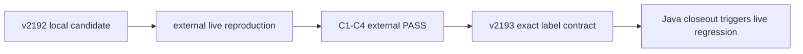

# v2193 代码讲解：把外部验收结论变成可维护的文档契约与联合回归入口

## 一、Goal / 目标

v2193 不是继续扩充功能，也不是再造一层 readiness 报告。它要解决的是“事实已经改变，但仓库的长期入口仍停留在旧事实”这一类维护问题。v2192 完成四项目只读联合验收后，外部评审没有只看归档文字，而是重新构建 Java jar、执行真实 mini-kv CLI、读取真实 aiproj registry 与 receipt，独立复跑了完整 C1-C4。复跑结果为 overall pass，四项 requirement 全部 pass，三个上游 commit 都被固定，同时继续满足 `read_only=true` 和 `execution_allowed=false`。因此，原先“local candidate PASS / external review pending”的状态已经过期。

外部 verdict 只授权一条精确成熟度标签：`single-project validation + verified read-only cross-project integration (env-gated, single machine, no execution authority)`。这条句子同时表达了已经证明的能力和仍然存在的限制：它不是单项目之间仅靠 fixture 对齐，因为真实进程与真实文件已经联合消费；它也不是生产集成，因为运行依赖显式环境门、发生在单机、没有执行授权。v2193 的第一目标，就是让 README、START_HERE、生产边界、最终证据和代理规则逐字使用同一标签，不留下多套互相冲突的口径。

第二目标是把 `npm run readiness:cross` 从“一次性验收命令”提升为明确的维护回归面。外部评审要求 Java 最终收口时重跑 capstone；如果仓库只在聊天或历史简报里记录这件事，下一位维护者很可能看不到。v2193 因此把触发条件、命令、输入、成功标准和默认 CI 排除原因写入 `docs/PRODUCTION_BOUNDARIES.md`，再由测试读取 package script、workflow、边界文档和 session bootstrap，机械保证这个入口不会悄悄消失或被误接入没有本地依赖的默认 CI。

## 二、Non-goal / 非目标

本版不修改 `src/integration/**`，不重跑真实 Java、mini-kv、aiproj 联合环境，也不生成一份内容相同的新 capstone 报告。原因不是省略验证，而是外部 reviewer 刚刚以独立环境完成了这一轮 live reproduction；本次授权动作是“应用标签、刷新文档测试、登记下一次回归触发点”。真正下一次 live 运行的时间点是 Java Stage-1 最终评审收口，届时 Java 输入发生了有意义的阶段变化，重跑才产生新的证据价值。

本版不新增 `regression:capstone` 之类的第二命令别名。现有 `readiness:cross` 已经是唯一入口，另造别名只会增加两个名称之间的漂移风险。也不把 live 命令放进 `.github/workflows/node-evidence.yml`：默认 runner 没有被授权访问用户机器上的兄弟仓库路径，也没有稳定的 Java jar、mini-kv CLI 和 aiproj 根目录。若 CI 因缺少输入而只得到 skipped，再把它显示成绿色，反而会降低证据可信度。

本版更不授权 Stage 2、生产写入、部署、凭据读取、rollback、schema migration 或任何上游 action。外部 verdict 明确指出 Java Stage-1 仍未完成，所以整个 program 尚未最终关闭。Node、mini-kv、aiproj 的 Stage-1 关闭与 capstone PASS，只能支持新的“verified read-only integration”标签，不能跨过 Java 最终评审，也不能把 `no execution authority` 从标签中删掉。

## 三、状态迁移：为什么不是简单改一句 README

这一版处理的状态迁移可以写成四个阶段：

在 A 阶段，仓库必须保守写“等待评审”，因为项目不能自授最终 PASS；在 B、C 阶段，外部 reviewer 通过真实输入把候选转成已验证事实；到了 D 阶段，代码库需要消费这个 verdict。如果只改 README，START_HERE 仍会告诉新会话“pending”，边界文档仍会阻止合法标签升级，测试仍会把旧文字当成期望值，AGENTS 甚至会继续命令后续 Codex 使用过期标签。于是下一次任何文档诚实性检查都会面对多个“权威来源”。

所以 v2193 的工程工作不是文字替换，而是对状态所有者进行一次完整迁移：公开入口负责读者理解，生产边界负责权限上限，最终证据负责可复现事实，playbook 负责进度账本，AGENTS 负责未来会话行为，测试负责机械防回退。历史 v2192 roadmap 不被改写成“当时就已经获得 PASS”，而是在保留本地候选语境后追加外部评审结果。这样既让当前状态准确，也不破坏历史发生顺序。

## 四、精确标签为何必须集中成测试契约

`test/productionMaturityContract.ts` 只导出两个常量：授权成熟度标签和 canonical live 回归命令。它不是产品运行模块，也不会进入 Node 服务；它的作用是让四组文档测试共享同一字节序列。没有这个常量时，每个测试文件都要复制一遍 135 个左右的英文字符，任何一个括号、连字符或词序差异都可能让“看起来相同”的标签实际分叉。

测试仍然把标签文字硬编码在仓库里，而不是动态从 README 读取。若测试从被测文档自身提取预期值，README 和测试同时写错仍然会通过。现在的关系是：外部 verdict 给出规范文本，测试常量固化规范，README、START_HERE、PRODUCTION_BOUNDARIES 和 final evidence 都必须包含该常量。未来如果有人想升级标签，必须显式修改契约测试和所有权威文档，评审 diff 会清楚展示这是一项状态变更，而不是随手润色。

第一次 focused 测试还捕获了一个细节：START_HERE 把 `not authorized` 与 `for production execution` 分到两个 Markdown 源码行。人眼渲染后仍能理解，但字符串契约不能把换行当空格，测试因此红灯。修正不是放松断言，而是把关键权限句保持为不可拆的完整源文本。这个失败很有价值，它说明文档测试检查的是仓库字节，而不是作者主观认为“意思差不多”。

## 五、Capstone Regression Surface 的五个组成部分

生产边界新增的回归面不是一句“以后记得跑”，而是五项可执行信息。

第一，**唯一命令**是 `INTEGRATION_LIVE=1 npm run readiness:cross`。`INTEGRATION_LIVE=1` 让外部读取从默认 skipped 进入真实执行，npm script 则继续指向 `tsx src/integration/readinessCrossCli.ts`。测试同时读取 `package.json`，防止文档仍写旧命令而脚本已经改名。

第二，**触发条件**包括 Java 最终 track close，以及对 `src/integration/**`、`readiness:cross`、aggregate schema、upstream probe contract 或所选 aiproj schema 的改变。前者来自当前 program 的明确要求，后几项来自影响分析：它们都会改变 C1-C4 的输入、编排或输出语义。纯 README 拼写修复不需要启动三项目；真正触碰联合契约时则不能只靠单元测试。

第三，**输入集合**必须显式提供 `JAVA_CAPSTONE_JAR`、`JAVA_CAPSTONE_COMMIT`、`MINIKV_CLI_PATH`、`MINIKV_CAPSTONE_COMMIT`、`AIPROJ_ROOT` 与 `AIPROJ_CAPSTONE_COMMIT`。只有路径没有 commit，会得到无法追溯的“某个本机文件”；只有 commit 没有路径，又无法执行真实消费。路径和提交成对出现，才回答得出“读取了哪份代码对应的哪份产物”。

第四，**通过标准**包括 schema v2、C1-C4 全 pass、三个 upstream commit 非空、`read_only=true`、`execution_allowed=false`、所有 owned process 退出和 Java 端口释放。把标准写全，是为了避免只看到 exit code 0 就忽略 provenance、权限位或清理失败。v2192 的归档路径被保留为 baseline，后续复跑可逐项比较。

第五，**默认 CI 排除**也属于契约。`productionExcellenceDocs.test.ts` 读取 workflow 并断言其中没有 `npm run readiness:cross`。这不是说 CI 永远不能支持联合运行，而是当前没有经评审的 runner、凭据边界和本地依赖布置。若未来建设专用 integration workflow，应通过新的计划显式改变这条测试，而不是在默认 Node evidence job 中偷偷启动兄弟系统。

## 六、四组测试分别保护什么

`productionExcellenceDocs.test.ts` 保护公开与运维入口。它要求生产边界包含精确标签、外部 C1-C4 PASS、Java 尚未关闭导致的 Stage 2 阻塞，并要求 README 与 START_HERE 同时出现授权标签、program-end PASS 和未授权生产执行。新增回归测试把 package script、workflow、boundaries、bootstrap 四个表面连接起来：命令必须存在，触发规则必须可发现，默认 CI 必须仍然不运行它。

`nodeTrackFinalEvidence.test.ts` 保护最终证据账本。它继续遍历 E1-E10，避免维护版在更新 capstone 状态时丢掉单项目门禁；同时把旧的 `LOCAL CANDIDATE PASS` 与 pending 断言替换成 external PASS、精确标签、capstone rerun 和 Stage 2 blocked。也就是说，标签升级不能通过删掉原有质量证据来完成。

`integrationCapstoneEvidence.test.ts` 仍读取冻结的 v2191 schema v1 报告，证明历史 C1-C3 evidence 没有被回写。它对当前文档的断言则改为授权标签和 Stage 2 边界，明确“历史证据仍是当时的事实，当前状态由后续评审推进”。这种分离避免为了让新状态测试通过而修改旧 fixture。

`integrationCapstoneV2192Evidence.test.ts` 继续逐项检查真实 v2192 schema v2、三个 commit、C1-C4、aiproj registry/artifact digest、9/8/4 契约统计、no-promotion 与进程清理。只把最后的治理状态断言从 pending 改成 external PASS。这样 v2193 没有降低 v2192 的技术证据强度，只改变了外部评审已经决定的状态字段。

## 七、每一步输入和输出

Step-0 的输入是四个仓库的真实 git 状态、Node v2192 绿色 CI、两份 Claude 评审追加和精确 verdict。输出是 `v2193-capstone-maturity-maintenance-roadmap.md` 中的需求-证据矩阵与停止条件。Java、mini-kv、aiproj 只被只读检查；它们的 dirty 文档没有被 Node stage、revert 或复制。

文档迁移的输入是外部授权句与旧的 candidate 状态。输出是 README、START_HERE、PRODUCTION_BOUNDARIES、node-track-final-evidence、playbook、AGENTS 和 v2192 历史后记。当前入口统一描述 external C1-C4 PASS；历史路线仍保留 v2192 在评审前为什么不得升级标签的解释。

测试迁移的输入是两条固定常量和上述权威文档。输出是四组 focused tests：任何文档漏改、标签字符漂移、旧 pending 重新出现、回归命令被删除，或 live capstone 被塞进默认 workflow，都会使测试失败。focused 首轮的换行失败已经证明该保护面会实际红灯，而不是只写了一组永远为真的断言。

归档输出位于 `d/2193/解释/` 与 `d/2193/evidence/`，代码讲解位于当前 r2000 volume。由于本版没有 UI、HTML、浏览器交互或可视状态，没有创建图片目录。对文档状态迁移最有力的证据是 git diff、focused test、typecheck、完整 suite、lint/security/census/build 和最终 CI，而不是一张显示 Markdown 的截图。

## 八、失败语义与排查顺序

如果公开文档测试失败，先看是标签逐字不一致、状态语句缺失还是关键句被源码换行拆断，不应立刻放松 `toContain`。如果 capstone regression 测试失败，应分别检查 package script 是否改名、boundary 是否漏掉 trigger、bootstrap 是否失去指针、workflow 是否误加 live 命令。四个检查对应四种不同风险，不能用一个模糊的“capstone”字符串替代。

如果 v2192 evidence 测试失败，不允许修改 `d/2192/evidence` 来迎合新文档。归档 JSON 是历史机器证据，v2193 只应修正当前状态消费层。若报告 schema 或 digest 真要变化，那属于新的 integration contract 版本，必须触发 live regression 和独立计划，而不是维护文档补丁。

如果完整 suite 出现 timeout，应先单跑失败文件，再跑相关组，确认断言本身是否通过；不能把 timeout 当业务错误改产品代码，也不能恢复此前造成 165 个 Node 进程的高并发方式。本版最终 full test 使用受控 worker 数，并在结束后检查本次没有留下 vitest、Node server 或 capstone 子进程。

## 九、为什么这版到此必须停止

v2193 完成后，Node 已经消费外部 verdict，并把下一次联合验证的触发点机械化。继续增加新 report、archive verifier 或 readiness chain 不会让 Java 更快完成 Stage-1，也不会提高当前 capstone 的证据质量，反而可能在 program 尚未整体关闭时制造新的未评审表面。因此本版的停止条件是文档契约、完整门禁、commit、tag、push 与最终 CI 全部完成，然后进入 maintenance-only。

真正下一步不在 Node 新功能队列，而在 Java 最终 track review。Java 收口后，按这里登记的命令准备固定 jar/CLI/root 与三个 commit，重跑 live C1-C4；若仍满足全 pass、只读、无执行授权和完整清理，才有资格讨论整个 program 关闭及 Stage 2。这个顺序把“已经做到的”与“尚未被授权的”分开，也让任何维护者都能从仓库自身恢复决策链，而不依赖本次聊天记忆。

## 十、维护者阅读顺序

要快速复核本版，先读 `production-excellence-final-acceptance.md` 末尾的外部 verdict，确认授权原文；再读 `v2193-capstone-maturity-maintenance-roadmap.md` 的矩阵和停止条件；然后看 `productionMaturityContract.ts` 与四个测试 diff，确认标签和回归命令如何被机械保护；最后看 `PRODUCTION_BOUNDARIES.md` 的 Capstone Regression Surface，确认触发、输入、成功条件和 CI 排除都完整。无需遍历上千个历史 service，也无需重新理解 v2192 的全部实现，除非归档 evidence 测试出现失败。

这就是 v2193 的维护价值：它没有虚构新的能力，而是把一次已经独立验证的能力，准确、克制、可追溯地写回仓库，并把未来何时必须再次证明它变成可以失败的规则。

## 十一、响应模型与一句话总结

本版没有新增 HTTP response，但它维护的是一个清晰的治理响应模型。输入由外部 verdict、v2192 机器证据、当前 git 状态和默认 CI 权限边界组成；状态转换只允许从 `local candidate` 进入 `externally verified read-only integration`；输出分成面向读者的成熟度标签、面向维护者的回归触发规则和面向机器的文档契约断言。任何输入缺失时，模型都应停在较保守状态：没有外部 verdict 就不能升级标签，没有六项 live 输入就不能把 capstone 当成 pass，没有 Java 最终评审就不能进入 Stage 2。

这个响应模型最重要的字段不是 `PASS` 本身，而是与它绑定的限制条件。`env-gated` 说明默认运行不接触兄弟系统，`single machine` 限定了已经验证的部署拓扑，`no execution authority` 阻止读证据被解释为执行操作。测试要求这些词作为一个整体出现，因此维护者不能只保留“verified integration”而删掉限定语。回归结果也必须同时返回 C1-C4、provenance、read-only、execution-disabled 和 cleanup 事实，不能把单一退出码提升为完整响应。

**一句话总结：v2193 把外部已复现的 C1-C4 PASS 收敛成一条不可夸大的成熟度标签和一组可失败的联合回归规则，同时继续封闭生产执行与 Stage 2。**
